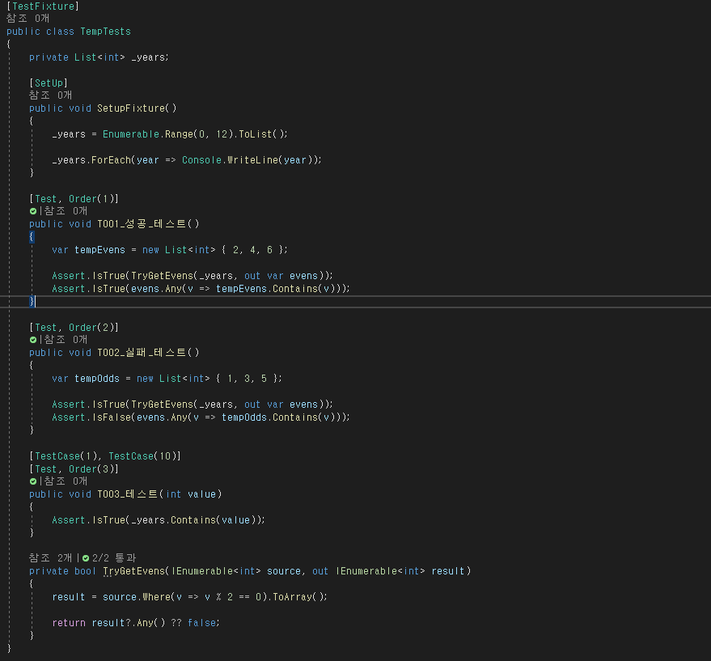
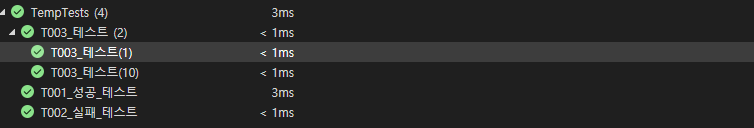

#04. 테스트 구축하기

##이해를 위해서는 실전이 최고

>짝수를 뽑아내는 함수를 테스트해보기로 한다.
>한 해를 12개월의 list로 테스트를 진행하였다.
>001의 경우 짝수가 나오는지 성공에 대한 테스트 케이스이고,
>002의 경우 홀수가 나왔다면 실패에 대한 테스트인지 확인이 된다.
>003의 경우 만약 12개월이 아닌 이후 데이터가 변경되어 13개월이 되었다면 비슷한 테스트 케이스를 만들어둘 필요도 있다. (경계 조건 검사)

##결과물

>매번 테스트 케이스를 작성함에 있어 일정의 +2일 정도가 추가 될 수 있다.
>작업에 대해 중요성을 못 느꼈으나 최근 많은 이슈 덕에 확연히 필요성을 알게 되었다.
>버그 리포트를 받으면 수정과 함께 바로 작성하도록 하자. 이슈 리뷰에서 전달하기 훨씬 수월하다.